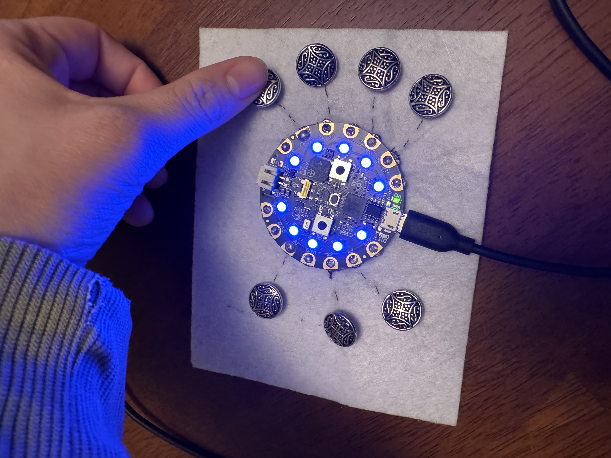
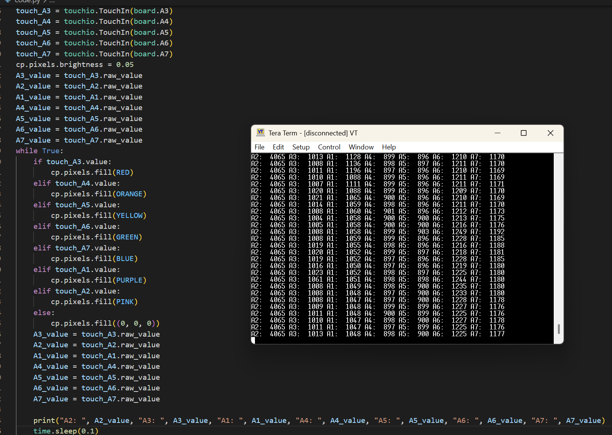

# CPX E-Textiles Color Buttons

A wearable project using the Adafruit Circuit Playground Express (CPX), sewable snaps, conductive thread, and metal sew-on buttons (decorative fabric buttons, not electronic push buttons) to trigger NeoPixel color changes via capacitive touch.

**Primary goal:** Gain hands-on experience soldering sewable snaps onto CPX pins and sewing conductive thread circuits on felt.

---





## Hardware

- Adafruit Circuit Playground Express (CPX)
- Sewable snaps (one half soldered to CPX pins, one half sewn to felt)
- Conductive thread
- Metal sew-on buttons (decorative fabric buttons, not electronic push buttons) (end points of the circuit on felt)
- Felt backing

## Pin-to-Color Mapping

| Pin | Color  |
|-----|--------|
| A3  | Red    |
| A4  | Orange |
| A5  | Yellow |
| A6  | Green  |
| A7  | Blue   |
| A1  | Purple |
| A2  | Pink   |

## Behavior

- **Switch ON:** Touching a button fills all NeoPixels with the mapped color. No touch = pixels off.
- **Switch OFF:** Pixels freeze at the last active color (intentional).

---

## Signal Path

```
CPX Pin → Soldered Snap (half A) ══ Snap (half B) → Conductive Thread → Jacket Button
```

Each junction (solder joint, snap connection, thread-to-button sew point) is a potential resistance or capacitance loss point.

---

## Critical: Do Not Touch Pads During Initialization

`touchio.TouchIn` sets its detection threshold from the raw capacitive value at startup. Touching a pad during init raises the baseline — that pin will not register touches for the rest of the session.

---

## How to Use
 
1. Attach the CPX to the felt backing via the sewable snaps.
2. Save `code/main.py` to the CPX as `code.py`.
3. **Do not touch any buttons or pads while the code initializes.** The capacitive threshold is set from the first reading at startup.
4. Flip the switch on the CPX to ON.
5. Touch a fabric button to trigger its mapped NeoPixel color.

---

## Troubleshooting Log

**Short between A3 and A2**
Either pin worked, neither signaled a touch independently. Located and removed the short — A3 recovered, A2 stopped working entirely. Multimeter confirmed continuity between the A2 snap on felt and its button, so the thread circuit was intact.

Used `touchio.raw_value` print loop to observe baseline and touch values directly. Determined the snap-to-felt sew joint was the failure point, not the thread run to the button.

Fix: cut out the A2 snap from the felt, resewed it, and connected it back into the existing thread run to the button. A better approach would have been to relieve mechanical strain at the snap before the thread run to the button — the snap junction is the most stress-prone point.

**CPX detached from felt backing**
When the CPX is not physically attached to the felt, touch detection works consistently every time. Attaching it introduces variability — likely from mechanical stress on snap joints and changed capacitive coupling through the felt and thread.

**Final state**
Results vary depending on what the raw values happen to be at initialization. For the scope of this project — learning to solder sewable snaps and sew conductive thread circuits — the outcome is a success.

---

## Lessons Learned

**1. touchio threshold is set at startup.**
Keep hands clear of all pads until the code finishes initializing.

**2. Capacitive signal is sensitive to connection quality.**
Moving A6 to the A2 pad position produced only ~288 raw value on touch vs. ~1278 for a working pin — same pad, different snap/thread quality. Use `touchio.raw_value` in a print loop to debug before relying on `.value`.

**3. Tie off the thread end at the snap.**
A2 failed when attached to felt but worked when touched directly on the wire. Root cause: the thread end was not tied into the running thread, breaking continuity at the snap.

**4. Environmental factors are the biggest source of inconsistency.**
Capacitive readings vary with humidity, grounding, nearby conductive objects, and how the board is held. This is inherent to capacitive sensing and not fully solvable without manual threshold tuning. Notably: the CPX works reliably when detached from the felt — attaching it introduces variability through mechanical stress and changed capacitive coupling.

**5. Solder joint durability on sewable snaps.**
One snap came loose under normal handling and had to be resoldered.

**6. The snap-to-felt junction is the highest stress point in the circuit.**
The A2 failure originated there, not in the thread run to the button. Something worth trying: anchoring the thread with extra stitches right at the snap before it runs to the button, so flex and pull are absorbed at those stitches rather than at the snap joint itself.

---

## Resources

- [Adafruit Circuit Playground Express](https://learn.adafruit.com/adafruit-circuit-playground-express)
- [touchio CircuitPython docs](https://docs.circuitpython.org/en/latest/shared-bindings/touchio/)
- [Adafruit Conductive Thread Guide](https://learn.adafruit.com/conductive-thread)
