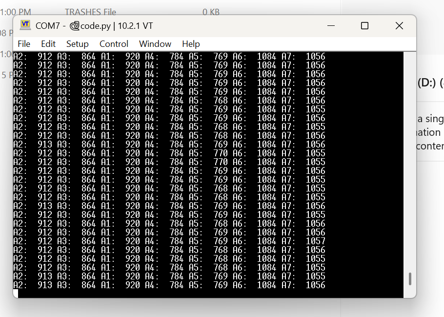

 while the ports are pulled it, A2 is getting value of 4096, when I touch another pin the value goes up to about 4095 but otherwise is 900s

 when i have the pins unplugged from the pad all are less than 1100

I moved the pins around to attach to different sewable snaps  A6 is now on where A2 was and didn't rise above that value 288 when touch
THe capacitance lowered this time which was interesting where for A2 it rose and A2 worked as expected

A2:  1049 A3:  992 A1:  1060 A4:  789 A5:  907 A6:  288 A7:  1212
A2:  1048 A3:  990 A1:  1061 A4:  787 A5:  909 A6:  288 A7:  1214
A2:  1048 A3:  992 A1:  1061 A4:  788 A5:  905 A6:  287 A7:  1214
A2:  1047 A3:  992 A1:  1060 A4:  789 A5:  907 A6:  284 A7:  1213
A2:  1050 A3:  992 A1:  1060 A4:  789 A5:  908 A6:  290 A7:  1214
A2:  1050 A3:  992 A1:  1060 A4:  788 A5:  908 A6:  291 A7:  1215
A2:  1049 A3:  992 A1:  1060 A4:  788 A5:  909 A6:  288 A7:  1213

This only A3 is attached to its pad, I cut out the pad for A2 and placed it on the wire directly and A2 was working as attended with conductive thread touching the snap so error: in thread of the snap... next step sew on the snap again and tie the end of the thread to the running thread to the button

the snap soldered on a 3.3V came off so had to resolder it on

When working

A2:  1057 A3:  1022 A1:  1057 A4:  921 A5:  913 A6:  1278 A7:  1222
A2:  1056 A3:  1020 A1:  1060 A4:  921 A5:  915 A6:  1278 A7:  1222
A2:  1060 A3:  1020 A1:  1060 A4:  921 A5:  912 A6:  1278 A7:  1222
A2:  1059 A3:  1020 A1:  1059 A4:  921 A5:  912 A6:  1277 A7:  1222
A2:  1058 A3:  1021 A1:  1057 A4:  922 A5:  913 A6:  1274 A7:  1221
A2:  1058 A3:  1021 A1:  1058 A4:  921 A5:  912 A6:  1278 A7:  1224
A2:  1055 A3:  1020 A1:  1059 A4:  921 A5:  913 A6:  1278 A7:  1222
A2:  1057 A3:  1021 A1:  1058 A4:  921 A5:  912 A6:  1277 A7:  1223
A2:  1059 A3:  1020 A1:  1058 A4:  920 A5:  913 A6:  1278 A7:  1222
A2:  1059 A3:  1021 A1:  1059 A4:  922 A5:  913 A6:  1278 A7:  1222
A2:  1059 A3:  1021 A1:  1059 A4:  921 A5:  913 A6:  1278 A7:  1222

Maje sure to not be touching any of the buttons or touch pads when the code first initializes because the threshold for when a touch is triggered is based on the initial reading